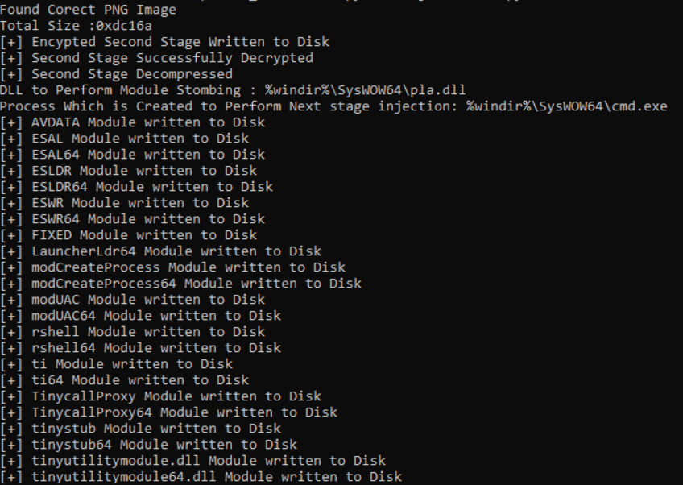

# Description
This Python script decrypts and decompresses HijackLoader's second stage, providing access to all of the modules

# Usage

```
hijackloader_config_extractor.py [-h] -f FILE_PATH_TO_HIJACKLOADER_SAMPLE_CONTAINING_EMBEDDED_PNG
```

The screenshot below shows an example of successful output after running the Python script provided.

