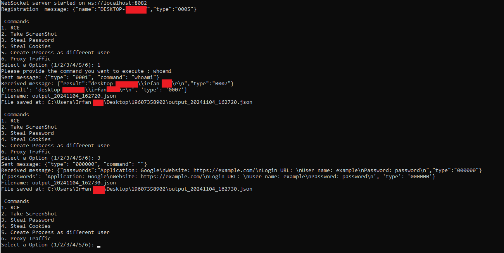

# Description
This Python script emulates the websocket server side of RevC2 by sending the type you select and rendering the response. Please make sure you are running RevC2 in a Sandbox VM.




## Usage

Use the following steps to use the websocket server side of RevC2

1. Edit the hosts file located at C:\Windows\System32\drivers\etc by adding the below line so the malicious traffic will be redirected to localhost.
```
127.0.0.1 nopsec.org
```
2. Download the files from this repository and unzip the file bajo.zip with password infected
3. Execute the following commands:
```
$ python -m pip install -r requirements.txt
$ python final_websocket.py
$ regsvr32 bajo.ocx
```
4. Select the type you need to execute
```
1. RCE
2. Take ScreenShot
3. Steal Password
4. Steal Cookies
5. Create Process as different user
6. Proxy Traffic
```
NOTE: For type 6 need to execute 2 more python scripts mentioned below which act as sender and listener socket to proxy traffic
```
$ python sender_socket.py
$ python listener_socket.py
```

